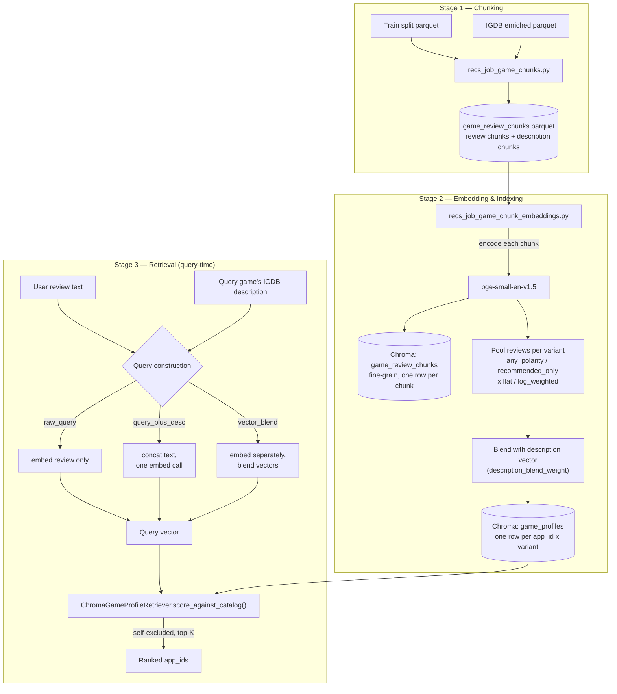

# RAG game-recommendation extension — staged plan

Status: **active** — Stages 1-3 (chunking, embedding & indexing, retrieval) built and evaluated.
Result: the embedder-swap ablation (`bge-small-en-v1.5`, see decision #4) beats the *currently
shipped* `two_tower_v1` on all three primary Stage 3 metrics, confirmed via the full
contract-conformant `rag_v2` eval run. **Caveat, important:** this is not evidence that RAG
retrieval is architecturally better than the two-tower approach — `two_tower_v1` fine-tunes USE
end-to-end (`hub.KerasLayer(..., trainable=True)`) and has never been retrained on bge-small, so
the comparison confounds "better architecture" with "one side got a free embedder upgrade and the
other didn't." Retraining `two_tower_v1` on bge-small isn't a cheap re-score like it was for RAG
(sentence-transformers is PyTorch, the training loop is TF/Keras) — no drop-in swap exists. Until
that's done, treat this as "beats the current production baseline," not "wins on architecture."
**Update**: ran the USE-controlled ablation (`recs_025`) — none of 24 cells close the gap on USE
alone, supporting "genuine embedder-quality effect" over "untuned-pipeline artifact." Then found
a bigger lever: vector-blended query construction (`recs_026`, on bge-small) beats both
`query_plus_desc` and `two_tower_v1` outright; a catalog pooling/blend-weight grid on top of that
(`recs_027`) pushed further to 0.532/0.517/0.514. **Promoted and confirmed**: Stage 2 rebuilt
(`any_polarity__log_weighted`, `blend_weight=0.05`), vector-blend query wired into
`chroma_retrieve.py`/`retrieval_offline_eval.py` as `rag_chunk_v1_vector_blend_query`, real
`recs_job_eval_offline.py` run (`rag_v3`) matches the notebook prototype exactly — best RAG
retrieval result across the whole series, beats `two_tower_v1` on all three primary cuts with the
widest margin yet. **The confound above is still open and matters more now**: the gap
`two_tower_v1` would need to close, if retrained on a modern embedder, has grown from ~0.04 to
~0.06 on Slice A Recall@K. See Stage 3 below for all ablations' numbers.
**Pausing here for now.** Headline: moved to a better sentence embedder (`bge-small-en-v1.5`),
which now beats the shipped `two_tower_v1` baseline. Open items (the `two_tower_v1` confound, the
personalization-phase performance follow-up, Stage 4) are recorded above/below, not blockers to
picking this back up later.
Owner: Ryan Reuther
Origin prompt: `_scrap/rag_extension.md`

## Context

Extending `steam-review-ml` with a RAG-based recommendation feature. This is **two new components**, not one: a new chunking-based retrieval variant, and a new LLM-based generation/ranking variant. Each is built and evaluated in isolation against the *current production component it competes with*, using the repo's existing three-level eval framework (end-to-end / isolated retrieval / isolated ranker), before combining into new end-to-end pipeline options. Secondary goal (stated explicitly): build the habit of interface-first, ablation-driven ML engineering decisions — this repo's decision-log culture ([`retrieval_decision_log.md`](../retrieval_decision_log.md), [`ranking_decision_log.md`](../ranking_decision_log.md)) is already that practice, formalized.

## Fact-check: what today's implementation actually is (corrections to the original plan's assumptions)

- **Game profiles today** (`scripts/recs_job_game_profiles.py`): filters reviews to `recommended==1` **only**, caps 200/game by `review_id` sort order (**deterministic, not by helpfulness**), min 30 chars. Never touches `votes_helpful` (the real column name — not "helpful"). Not reusable as-is for the new chunk table.
- **Current game embedding method is embed-then-pool, not concatenate-then-embed**: `game_profile_embedding_meta.json` records `method: "encode_each_raw_review_mean_pool_per_app_id_l2_normalize"` — USE embeds **each review individually** (clipped to 8000 chars/review — not a binding limit in practice), then mean-pools the per-review vectors into one game vector, L2-normalized. This matters directly for Stage 1 design (see below).
- **Shipped retrieval is not flat embedding similarity.** It's `two_tower_v1`, a *trained* two-tower model (`two_tower_train.py` / `two_tower_score.py`) retrieving @100. Flat cosine similarity over static game-profile embeddings (`ContentRetriever`, `method=raw`) is a legacy ablation baseline that `two_tower_v1` already beat.
- **Shipped ranker** `two_tower_v1_v2a_embed_query_logpop_blend` is a **heuristic linear blend** (D1 logpop blend + IGDB taxonomy USE cosine, `w_meta=0.1`), not a learned model. It superseded D1 after **four different learned-ranker lineages were killed** for underperforming it: D2 pointwise MLP (NDCG@10 0.089/0.063 overall/Slice A), D3 listwise LTR (0.085/0.059), D4 cross-encoder (0.091/0.070* — closest contender), D5 USE-embed/cascade variants (0.034–0.040), all against v2a's own **0.095/0.070** on `val_dev_12k_v1`. This is the real bar Stage 4 needs to clear — a non-heuristic ranker has come close (D4) but never won.
- **IGDB enriched parquet already exists** (`artifacts/igdb/igdb_games__enriched.parquet`) and already fetches `summary`/`storyline` text, but today only genres/themes/keywords get embedded (pooled USE) for reranking — the summary/storyline text has never been embedded. This is the "game description" source for Stage 1/3 — zero new data acquisition.
- **Chroma installs cleanly** via pip in the `tf_condaforge` conda env (verified via dry-run) — heavier footprint than the rest of the repo (onnxruntime, kubernetes client, opentelemetry) but no conflicts. **Its role: vector store only** — USE still produces the vectors; Chroma stores them + metadata (recommended rate, chunk variant) and handles nearest-neighbor search + metadata filtering (self-exclusion, future filters). It replaces the current `.npz` + `.parquet` static files `ContentRetriever` reads today — same job, different storage/query engine.
- **Existing rerankers are already embedding-agnostic**: `score_logpop_blend` / `score_v2a_embed_query_logpop_blend` take `retrieval_scores` as a generic per-pool array, min-max normalized. Swapping the retrieval encoder doesn't require reworking ranking logic — only potentially re-tuning blend weights if a heuristic reranker is later pointed at a different retriever's pool (see build-order lattice below — this is now a real scenario, not just hypothetical).
- **Established repo convention**: build new rankers as isolated spike modules (`ranker_d2_pointwise.py` … `ranker_d6_biencoder.py`) and only wire into the shared `pool_rerank_registry()` if they clear the promotion bar. New components in this plan follow the same convention.
- **`eval_cache` mechanism already exists** (`recs_job_build_eval_examples.py`, `--examples-parquet`) for exactly the "small frozen dev cohort vs. full val gate" pattern LLM-based methods need — no new infra required.

## Decisions made so far

1. **Ablation B** (query shape, Stage 3): raw review text vs. review text + query game's own IGDB description.
2. **Ablation A2** (review polarity, Stage 1): recommended-only top-50-by-helpfulness vs. any-polarity top-50-by-helpfulness. Needed because a meaningful aggregate "recommended rate" requires negative reviews to be eligible for the top-50 — runs alongside Ablation A (flat vs. log-weighted aggregation), so Stage 1 has **4 chunking variants** to build and compare.
   - **Cap = 50**: the original 20 was sized for concatenate-then-embed (avoid an overlong text blob), a constraint that no longer applies under embed-then-pool. 50 is fixed **across both Ablation A arms** so the ablation isolates "does log-weighting help," not "does a different review-set size help" — the flat arm still needs *some* cap as its only defense against a long tail of low-helpfulness noise, since it weights every included review equally.
3. **Game description source**: IGDB `summary`/`storyline`, already fetched/joined — confirmed.
4. **Stage 2 embedding model**: originally USE (TF Hub), consistent with the rest of the pipeline. **Superseded**: an embedder-swap ablation (`recs_024_stage3_embedder_ablation.ipynb`) found `BAAI/bge-small-en-v1.5` (sentence-transformers, retrieval-tuned asymmetric query/passage encoder, 384-dim) beats both USE and the general-purpose `all-mpnet-base-v2` on Hit@K/Recall@K, and clears the `two_tower_v1` bar on all three primary cuts in a fast prototype. Promoted into Stage 2/3 for real: `scripts/recs_job_game_chunk_embeddings.py` and `ChromaGameProfileRetriever` (`chroma_retrieve.py`) now default to `bge-small-en-v1.5`; queries get BGE's own instruction prefix (`BGE_QUERY_PREFIX`), passages/chunks do not. Chroma rebuilt from scratch (384-dim can't share a collection with USE's 512-dim). Full contract-conformant eval rerun (`rag_v2`) in progress to confirm the prototype numbers — see Stage 3 below.
5. **LLM eval scale**: build a small frozen `eval_cache` subset (~100–300 examples) via the existing cache mechanism for all LLM-based methods. Keep **full 100-candidate pools per example** — truncating candidates-per-example was considered and rejected: it breaks the `Oracle@K` fairness contract (positives outside the truncated slice become structurally unreachable) and doesn't meaningfully reduce cost anyway, since cost scales with cohort size, not candidates-per-call.
6. **Stage 4 LLM backend**: **local-first, via llama.cpp**. The call is designed behind a swappable-backend interface (mirroring the `pool_rerank_registry()` pattern) so a hosted Anthropic API backend (credential pattern already exists in `.github/scripts/review_pr.py`) can be added later as a **local-vs-hosted quality/cost ablation**. HF transformers + bitsandbytes is a **later note only**, using an official base model (e.g. `Qwen/Qwen2.5-7B-Instruct` or `meta-llama/Llama-3.1-8B-Instruct`) — explicitly **not** a community "Claude-Opus-distilled" upload considered earlier, which trains on scraped Claude API outputs (likely a ToS violation for that source data) with no independent benchmark validation.
7. **Blend-hyperparameter retuning** (`w_meta`): not needed for the Stage 5 "new retrieval + new generation" combo. **Does become relevant** for the "new retrieval + existing v2a ranker" combo in the build-order lattice below, if that combo ever ships — flagged there, not solved yet.
8. **Stage 1 chunk construction: embed-then-pool, confirmed.** The **chunk is the review-level embedding unit** (one embedding per review, plus one for the description) — not a concatenated per-game text blob. This is the right atomic level: reviews are already short, single-topic, self-contained opinions — the natural atomic unit in this corpus — unlike long-form documents (wiki pages, textbooks) that need artificial paragraph/hierarchical splitting because they mix many sub-topics in one text. Splitting a review further (e.g. by sentence) would fragment *below* the natural unit, not above it. Embed-then-pool also means embedding happens **once** — all 4 Ablation A × A2 variants are different weighted-pooling passes over the same underlying chunk embeddings, not 4 separate embed runs.
9. **Description handling**: the description gets its own chunk embedding, kept **separate** from the reviews' weighted average, then **blended** with the pooled-review vector to form the game profile vector. Blend ratio is an open tunable (see below), not an architecture decision.
10. **Chroma schema — two collections, different grain**: `game_review_chunks` (fine-grain — one row per `app_id`+`review_id`, plus one per-game row for the description; built once, covers the any-polarity superset so both Ablation A2 arms just filter this same table; retained specifically to keep the door open for future multi-turn-chat citation/explainability) and `game_profiles` (coarse-grain — one row per `app_id` × variant; `embedding = blend(pooled_review_vector, description_vector)`; this is the actual Stage 3 retrieval index).
11. **Stage 5 eval, post-pivot**: since Stage 4 no longer ranks anything (§ 2026-08-24 pivot, `ranking_decision_log.md`), Stage 5 splits into two independent eval tracks instead of one combo — see Stage 5 section below. The explanation LLM-judge gets a **hard promotion bar** (mean ≥4.0/5 on groundedness and relevance, zero hallucinations), superseding the earlier "read, not scored" framing now that explanation output feeds a real gate. Judge backend: hosted Anthropic API, not the local Llama-3.1 generator, to avoid self-judging bias.

## Open — not yet decided

**Blend ratio** between the pooled-review vector and the description vector in `game_profiles`. Not needed to start Stage 1/2 build — can default to something simple and become its own future ablation, same role as `w_meta` in the existing v2a ranker.

## Staged plan

### Architecture overview (Stages 1-3)

Best config found so far (`recs_027`, pending promotion — see Stage 3 below): `bge-small-en-v1.5`,
`any_polarity__log_weighted` pooling, `description_blend_weight=0.05`, `vector_blend` query
construction at `w=0.5`.

### Stage 1 — Chunking (new retrieval variant, input side)
**Depends on:** nothing new (train split parquet + IGDB enriched parquet already exist).

- New job `scripts/recs_job_game_chunks.py` + `configs/recs_job_game_chunks.json`, modeled on `recs_job_game_profiles.py` but: keeps `votes_helpful` (currently dropped), does **not** pre-filter to `recommended==1` (selects the any-polarity top-50-by-`votes_helpful` superset per game; the A2 polarity arm is a metadata filter at pooling time, not a separate selection), folds in IGDB `summary`/`storyline` per `app_id` as its own chunk.
- Output is chunk-level (one row per `app_id`+`review_id`, plus one per-game description row) — this becomes `game_review_chunks` in Stage 2, before any pooling happens.
- 4 pooling variants (Ablation A weighting × A2 polarity) are computed downstream from this same chunk table — cheap re-aggregation, not re-embedding. Evaluate at full scale via the existing frozen-baseline + regression-test pattern (mirror `tests/test_retrieval_eval_regression.py`).

### Stage 2 — Embedding & indexing
**Depends on:** Stage 1 chunk table.

- Reuse USE (TF Hub); embed each chunk (review or description) **individually** — this is the one embedding pass, shared by all 4 downstream variants.
- Two Chroma collections under `artifacts/recs/embeddings/game_chunks/chroma/` (mirrors the `embeddings/game_profile/default/` layout convention):
  - **`game_review_chunks`** — fine-grain, one row per chunk (`app_id`+`review_id`, or the description sentinel), metadata: `votes_helpful`, `recommended`, `chunk_type`. Built once.
  - **`game_profiles`** — coarse-grain, one row per `app_id` × variant, `embedding = blend(pooled_review_vector, description_vector)` (weighted mean pool per decision #8/#9), metadata: `variant`, `recommended_rate`, `n_reviews_pooled`. This is the collection Stage 3 actually queries.
- Add `chromadb` as a new optional extra in `pyproject.toml` (e.g. `rag = ["chromadb>=1.5"]`), matching the existing per-capability extras pattern.

**Verified counts** (`recs_022_eda_chroma_game_profiles.ipynb`): 16,010 `game_review_chunks` rows (15,695 review + 315 description, 315 games) produce the 4 `game_profiles` pooling variants below.

| Variant | Polarity | Weighting | Pooling formula | Rows |
|---|---|---|---|---|
| `any_polarity__flat` | all reviews | uniform mean | `mean(review_vecs)` | 315 |
| `any_polarity__log_weighted` | all reviews | `log1p(votes_helpful)` | `sum(w * review_vecs)`, `w ~ log1p(votes_helpful)` | 315 |
| `recommended_only__flat` | `recommended==1` only | uniform mean | `mean(review_vecs)` on filtered subset | 314 |
| `recommended_only__log_weighted` | `recommended==1` only | `log1p(votes_helpful)` | `sum(w * review_vecs)` on filtered subset | 314 |

Each pooled vector is then blended with the game's IGDB description vector (`(1-w)*pooled + w*description`, `description_blend_weight`, default 0.1) and L2-normalized. The 1-row shortfall on both `recommended_only__*` variants is the same game (`app_id` 285190) skipped for zero eligible (`recommended==1`) reviews.

### Stage 3 — Retrieval (query-time), new retrieval variant
**Depends on:** Stage 2 index.

- New retriever class analogous to `ContentRetriever`, backed by Chroma queries instead of a static `.npz` cosine-sim matrix.
- Mandatory self-exclusion via Chroma metadata `where` filter (`app_id != query_app_id`) — mirrors `StackedRecommender`'s existing query-game masking.
- Ablation B: raw review text vs. review text + query game's own IGDB description as query text.
- Register as a new `methods` entry in `recs_job_eval_offline.py`'s config (alongside `raw`, `two_tower_v1`, …) so it flows through the existing retrieval contract (`eval_retrieval_*`) with no new eval infra. Compared primarily against `two_tower_v1` (the real shipped bar) and secondarily against `raw` (same flat-cosine mechanism).
- Qualitative check (not just metrics): manually inspect a sample of Ablation-B arm-2 (query + description) results for the franchise/marketing over-indexing failure mode called out in the original plan.
- **If this wins its own isolated retrieval-eval comparison, it is independently shippable** — see build-order lattice below; it does not need Stage 4 to succeed first.

**Results** (`rag_v1` eval run, `configs/recs_job_eval_offline_rag_v1.json`, `variant=any_polarity__flat`; notebook: `recs_023_stage3_qualitative_check.ipynb`):

| method | Hit@K (overall) | Recall@K (Slice A, primary) | Hit@K (Slice B, primary) |
|---|---|---|---|
| `two_tower_v1` (bar) | 0.512 | 0.460 | 0.496 |
| `rag_chunk_v1_query_plus_desc` | 0.475 | 0.453 | 0.456 |
| `raw` | 0.453 | 0.430 | 0.435 |
| `rag_chunk_v1_raw_query` | 0.425 | 0.389 | 0.406 |

- **Ablation B winner: query + description**, beating raw-query on every cut (+0.05 Hit@K overall) and edging out `raw`. Neither RAG arm beats `two_tower_v1` on its primary Slice A/B metrics — **not independently shippable yet** per the build-order lattice.
- Qualitative check (5 most-divergent, franchise/company-tagged examples): the predicted franchise/marketing self-bias never appeared in either arm. But `query_plus_desc`'s genre-coherence edge isn't universal — 3/5 clear wins, 1/5 a regression (NieR:Automata drifts from action-RPG peers to strategy games), 1/5 mixed. Treat "description helps" as example-dependent, not a clean win.
- Open ablation levers surfaced by this pass: ~~swap USE for a modern sentence-embedding model~~ **done, see below**; tune `description_blend_weight` (still the placeholder 0.1 default); evaluate the other 3 pooling variants (`log_weighted`, `recommended_only__*`); blend query-side review/description as separate vectors instead of concatenated text (mirrors how `game_profiles` are already built, gives a tunable weight instead of an all-or-nothing splice).

**Embedder-swap ablation** (`recs_024_stage3_embedder_ablation.ipynb`; fast in-notebook prototype — flat cosine over the 315-game RAG catalog, same cohort/positives as `rag_v1`, not yet run through the real eval job at the time these numbers were produced):

| embedder | Hit@K (overall) | Recall@K (Slice A, primary) | Hit@K (Slice B, primary) |
|---|---|---|---|
| `two_tower_v1` (bar) | 0.512 | 0.460 | 0.496 |
| `current` (USE) | 0.475 | 0.453 | 0.456 |
| `all-mpnet-base-v2` | 0.448 | 0.425 | 0.429 |
| **`bge-small-en-v1.5`** | **0.516** | **0.485** | **0.499** |

- `bge-small-en-v1.5` clears `two_tower_v1` on all three cuts; `all-mpnet-base-v2` regresses vs. current USE — model size/generality alone didn't help, retrieval-specific (asymmetric query/passage) training looks like the real lever.
- **Promoted**: Stage 2 (`recs_job_game_chunk_embeddings.py`) and Stage 3 (`ChromaGameProfileRetriever`) now default to `bge-small-en-v1.5`; Chroma rebuilt from scratch (384-dim).

**Confirmed via full contract-conformant eval** (`configs/recs_job_eval_offline_rag_v2.json`, `artifacts/recs/offline_eval/runs/rag_v2`, real `recs_job_eval_offline.py` run, not the notebook prototype):

| method | Hit@K (overall) | Recall@K (Slice A, primary) | Hit@K (Slice B, primary) |
|---|---|---|---|
| `two_tower_v1` (bar) | 0.512 | 0.460 | 0.496 |
| **`rag_chunk_v1_query_plus_desc`** (bge-small) | **0.516** | **0.485** | **0.499** |
| `rag_chunk_v1_raw_query` (bge-small) | 0.483 | 0.439 | 0.467 |
| `raw` | 0.453 | 0.430 | 0.435 |

Matches the notebook prototype almost exactly (0.516/0.485/0.499 vs. 0.516/0.485/0.499) — the
prototype's flat-cosine simplification was valid. **`rag_chunk_v1_query_plus_desc` +
`bge-small-en-v1.5` beats the *currently shipped* `two_tower_v1` on all three primary cuts** —
this is the first RAG arm to clear that bar. **Not yet "independently shippable" on architectural
merit**: `two_tower_v1` fine-tunes USE end-to-end and has never been retrained on bge-small, so
this result confounds "RAG is a better approach" with "RAG got a free embedder upgrade and
`two_tower_v1` didn't." It's a valid answer to "does this beat production today" (which is what
the build-order lattice's shipping decision actually asks); it is not yet a valid answer to "is
RAG architecturally better than two-tower." Next: hold the embedder fixed at USE (the same one
`two_tower_v1` uses) and test the other RAG levers to see if pipeline choices alone can close the
gap without an embedder confound — see below.

**USE-controlled ablation** (`recs_025_stage3_use_controlled_ablation.ipynb`; embedder held fixed
at USE — the same one `two_tower_v1` uses — specifically to test whether pipeline tuning alone,
with no embedder confound, can close the gap. Tests both `description_blend_weight` (`{0.0, 0.05,
0.1, 0.2, 0.3, 0.5}`) and all 4 pooling variants, 24 cells total; sanity-checked against `rag_v1`'s
real numbers, exact match):

| pooling_variant | blend_weight | Hit@K (overall) | Recall@K (Slice A) | Hit@K (Slice B) |
|---|---|---|---|---|
| `two_tower_v1` (bar) | -- | 0.512 | 0.460 | 0.496 |
| **`any_polarity__flat` (best config)** | **0.3** | **0.476** | **0.457** | **0.458** |
| `any_polarity__flat` (untuned default) | 0.1 | 0.475 | 0.453 | 0.456 |
| `any_polarity__log_weighted` (best) | 0.3 | 0.474 | 0.453 | 0.456 |
| `recommended_only__flat` (best) | 0.3 | 0.471 | 0.448 | 0.454 |
| `recommended_only__log_weighted` (best) | 0.3 | 0.471 | 0.445 | 0.454 |

- **Best config found: `any_polarity__flat`, `blend_weight=0.3`** — wins on Slice A Recall@K
  (the tiebreaker) vs. `0.2`, tied on the other two cuts. Zero of the 24 cells beat `two_tower_v1`
  on all three primary cuts. Blend-weight tuning is a real but tiny lever (shallow optimum at
  0.2-0.3, worth +0.001 to +0.004 vs. the untuned 0.1). `log_weighted` and `recommended_only`
  both **underperformed** plain `any_polarity__flat` across every blend weight — the opposite of
  what was predicted; weighting by helpfulness or dropping negative reviews didn't clean up the
  signal, it shrank the pool and added noise.
- **The Slice B Hit@K gap barely moves**: best USE cell tops out at 0.458 vs. `two_tower_v1`'s
  0.496 — a ~0.04 gap unaffected by either lever tested.
- **Answers the confound question, as much as a notebook can**: pipeline tuning alone (no
  embedder change) cannot close the gap. This is evidence — not proof, since `two_tower_v1` still
  hasn't been retrained on bge-small — that the embedder-swap result in `recs_024`/`rag_v2` is a
  genuine embedder-quality effect, not an artifact of an untuned pipeline being compared against
  a tuned one.

**Vector-blended query construction** (`recs_026_stage3_vector_blend_query.ipynb`; the 4th lever,
tested on `bge-small-en-v1.5` — the shipped embedder — not USE, since this is a shipping-config
question, not a confound-control one. `query_plus_desc` concatenates review + description text
before one embed call; the alternative embeds them separately and blends the two *vectors*,
`normalize((1-w)*review_vec + w*description_vec)`, `w` swept `{0.0, 0.05, 0.1, 0.2, 0.3, 0.5, 0.7,
0.9, 1.0}`. Sanity-checked against `rag_v2`'s real numbers, exact match):

| mode | weight | Hit@K (overall) | Recall@K (Slice A) | Hit@K (Slice B) |
|---|---|---|---|---|
| `two_tower_v1` (bar) | -- | 0.512 | 0.460 | 0.496 |
| `query_plus_desc` (text-concat, shipped) | -- | 0.516 | 0.485 | 0.499 |
| **vector-blend (peak)** | **0.5-0.7** | **0.530-0.532** | **0.508-0.509** | **0.513-0.514** |
| vector-blend | 1.0 (pure description) | 0.518 | 0.483 | 0.500 |

- **Biggest lever found in the whole ablation series.** Crossover vs. text-concat is between
  `w=0.2` and `w=0.3`; every weight from `0.3` to `1.0` beats `two_tower_v1` outright.
- **Surprise**: pure description with zero review signal (`w=1.0`) nearly ties `query_plus_desc`
  — unexplained, flagged for a qualitative follow-up.

**Catalog pooling × blend-weight grid on bge-small + vector-blend query**
(`recs_027_stage3_bge_pooling_blend_grid.ipynb`; reruns `recs_025`'s grid, but on the actual
shipped/winning pipeline instead of the stale USE + text-concat combination. Query fixed at
vector-blend `w=0.5`. Sanity-checked against `recs_026`'s real number, exact match):

| pooling_variant | catalog_blend_weight | Hit@K (overall) | Recall@K (Slice A) | Hit@K (Slice B) |
|---|---|---|---|---|
| `two_tower_v1` (bar) | -- | 0.512 | 0.460 | 0.496 |
| `recs_026` baseline (untuned catalog) | 0.1 | 0.530 | 0.509 | 0.513 |
| **best: `any_polarity__log_weighted`** | **0.05** | **0.532** | **0.517** | **0.514** |

- **All 24 cells beat `two_tower_v1`** (vs. 0/24 in `recs_025`'s USE grid) — the vector-blend
  query switch alone clears the bar regardless of catalog config; catalog tuning adds a further
  real gain on top (+0.008 Recall@K Slice A, roughly double `recs_025`'s USE-side effect).
- **`log_weighted` reverses from `recs_025`**: lost to `flat` under USE, wins under bge-small +
  vector-blend query — pipeline optima aren't fixed properties of the data, they interact with
  embedder and query-construction choice.

**Best full config found and confirmed**: `bge-small-en-v1.5` + `any_polarity__log_weighted`
pooling + `catalog_blend_weight=0.05` + vector-blend query (`w≈0.5`). Promoted: Stage 2 rebuilt
(`blend_weight=0.05`), `chroma_retrieve.py`/`retrieval_offline_eval.py` wired with a new
`rag_chunk_v1_vector_blend_query` method (`ChromaGameProfileRetriever.embed_query_vector_blend`).
Real `recs_job_eval_offline.py` run (`rag_v3`, `artifacts/recs/offline_eval/runs/rag_v3`)
**confirms the prototype exactly**:

| method | Hit@K (overall) | Recall@K (Slice A, primary) | Hit@K (Slice B, primary) |
|---|---|---|---|
| `two_tower_v1` (bar) | 0.512 | 0.460 | 0.496 |
| **`rag_chunk_v1_vector_blend_query`** | **0.532** | **0.517** | **0.514** |
| `rag_chunk_v1_query_plus_desc` (old default) | 0.515 | -- | -- |
| `rag_chunk_v1_raw_query` | 0.486 | -- | -- |

This is now the strongest RAG retrieval result across the whole series, matching `recs_027`'s
notebook prototype to 3 decimal places — full confidence this isn't a scoring artifact.

**Performance follow-up, found while running `rag_v3`**: `_table_personalization`
(`retrieval_offline_eval.py`) recomputes every method's score from scratch, per example, on
every personalization round (overall + per popularity decile + per support bucket, ~17 rounds
total) — nothing from the main scoring pass is cached or reused. `rag_chunk_v1_vector_blend_query`
calls `embed_text()` twice per example (review + description, each an unbatched batch-of-1 model
call) where `raw_query`/`query_plus_desc` only call it once, so this one method alone roughly
doubles personalization-phase cost — over 12,500 examples × ~17 rounds, `rag_v3` ran
noticeably longer than `rag_v2`. Not urgent (this run still completes, just slower), but worth
fixing before adding more multi-embed-call RAG methods: either cache each example's
scores/embeddings across personalization rounds instead of recomputing them ~17x, or batch the
embed calls instead of one-at-a-time.

**The `two_tower_v1` confound is still open, and now matters more.** All numbers above compare
against the *same*, USE-trained `two_tower_v1` — the gap it needs to clear has grown from
0.516/0.485/0.499 (`recs_024`) to 0.532/0.517/0.514 (`recs_027`), but `two_tower_v1` itself has
never been retrained on bge-small (or any modern embedder). Every ablation in this series has
made the *RAG side* better; none has touched whether `two_tower_v1` would also improve with a
better sentence embedder as its (fine-tuned) input encoder. That remains unmeasured — a real
retraining job (`two_tower_train.py`, TF/Keras, `hub.KerasLayer(..., trainable=True)`), not
something re-scorable in a notebook — no drop-in swap exists since bge-small is a PyTorch/
sentence-transformers model. Two options if pursued: (a) freeze bge-small's embeddings as fixed
input features and train a new projection/tower on top (cheaper, closer to today's architecture),
or (b) reimplement tower training in PyTorch so bge-small can be fine-tuned end-to-end like USE
is today (more faithful comparison, more engineering work). **Deliberately held off for now** —
until that's run, "beats `two_tower_v1`" means "beats the current production model," not "RAG
retrieval is architecturally better than two-tower."

Not yet done: re-tuning `w_meta` for this cell of the lattice (decision #7, if pairing with the
existing v2a ranker); re-checking whether the NieR:Automata-style genre-drift regression from
the qualitative check (`recs_023`) persists with the new config; promoting the `recs_027` winning
config into the real Stage 2/3 pipeline; the `two_tower_v1`-on-a-modern-embedder question above.

### Stage 4 — Generation (new ranker-stage option)

**Status (2026-08-24): reranking killed, pivoted to explanation generation.** Full decision,
real numbers, and evidence: `docs/ranking_decision_log.md` § 2026-08-24. Summary: real 200-example
eval on `val_llm_mini_v1` (frozen subset of `val_dev_12k_v1`) showed `ranker_llm_local.py`
(Llama-3.1-8B-Instruct, local via `llama-cpp-python`) losing decisively to v2a recomputed on the
same cohort — NDCG@10 0.033 vs 0.097, roughly 1/3. Root cause: capability mismatch (zero-shot text
reasoning over truncated descriptions vs. v2a/`two_tower_v1`'s trained collaborative-filtering
embeddings), not an engineering bug — the fifth learned/generative ranker (after D2–D5) to lose to
the same heuristic baseline. Engineering plumbing (below) all worked correctly and is preserved as
a spike, not deleted.

**Pivot**: `LlamaCppBackend.generate_explanation()` generates a grounded natural-language
explanation for the top-1 recommendation from the existing, unchanged `two_tower_v1` → v2a stack,
instead of reranking with the LLM — sidesteps the exact weakness just measured (this is
generation, not discrimination among ~100 candidates). Validated against real
`StackedRecommender` output. No promotion bar (quality is read, not scored). See
`notebooks/ranking/recs_029_stage4_llm_explanation_spike.ipynb`.

**Independent of Stages 1–3** — its primary comparison uses the *existing* frozen `two_tower_v1` @100 pools (`artifacts/recs/offline_eval/runs/latest/eval_offline_examples.jsonl`), which already exist today. **Build order: Stages 1–3 first**, Stage 4 after.

Original plan (executed as written, then killed on results — kept here as the record of what was
built and why, not a forward-looking TODO anymore):

- **Data gap, noted for when we get here**: `eval_offline_examples.jsonl` holds only IDs/scores — no query text, no candidate text (heuristic rerankers never needed either, since they only do `app_id`-keyed numeric lookups). An LLM ranker does. Fix: extend `recs_job_eval_offline.py`'s own output, then **rerun the job** — verified the cohort sampling is seeded (`np.random.default_rng(PROJECT_RANDOM_SEED)` in `retrieval_offline_eval.py`) and retrieval scoring is a deterministic forward pass, so rerunning with the same config reproduces the identical cohort/pool, just with more fields — no separate downstream enrichment/join script needed. Query text is close to free (already computed internally, just not currently written out); candidate text (`app_id` → title/description/genres) is genuinely new lookup logic. Add both as an **opt-in** addition (new field or sibling output file, flag-gated) rather than changing the core jsonl schema unconditionally, since that job is shared by every method's eval and its output is checked by `tests/test_retrieval_eval_regression.py`. Detail to work out when we build Stage 4, not now. — **Done**: `include_query_text_in_examples_jsonl` opt-in flag, default off.
- Build a small frozen `eval_cache` cohort (~100–300 examples) via `recs_job_build_eval_examples.py` (new config, e.g. `configs/recs_job_build_eval_examples_llm_mini.json`). — **Done, different mechanism**: `val_llm_mini_v1` is a *deterministic subset of `val_dev_12k_v1`* (`scripts/recs_job_subsample_eval_cohort.py`), not an independent resample — keeps it a true subset of the population every other ranker was measured against.
- New isolated spike module `src/steam_review_ml/recommender/ranker_llm_local.py` (naming mirrors `ranker_d4_cross_encoder.py`), **not** wired into `pool_rerank_registry()` until it clears the promotion bar. — **Done**; not wired in (killed).
- LLM call behind a swappable-backend interface (`generate_ranking(query_text, candidates) -> ranked_list`); `LlamaCppBackend` is the initial implementation. Leaves room for `AnthropicBackend` and a `TransformersBitsAndBytesBackend` later as ablations. — **Done**: `LLMRankerBackend` is an ABC (not `Protocol`) — deliberate, since this repo has no mypy/type-checking gate in CI, so ABC's runtime `TypeError`-on-missing-method enforcement is the only real safety net. Also required redesigning the prompt contract from "rank all ~100 candidates" (0/3 real examples parsed cleanly) to "pick your top 10" (14% failure rate, matches what `k_final` actually evaluates) — see decision log for the full story.
- Ablation C: minimal-token ranked-list-only output vs. chain-of-thought reasoning-then-rank output — evaluate whether (b) beats (a) on ranking quality (not just explainability), using the same `eval_ranking_*` metrics as the existing rank-only eval job. — **Only arm 1 (minimal) run**; arm 2 (CoT) deferred, not worth pursuing given the size of the gap.
- Promotion bar: v2a's NDCG@10 0.095 overall / 0.070 Slice A — note this is the *full 12k-cohort* number; the small-cohort LLM run needs its own heuristic-ranker baseline computed on the **same small cohort** for a fair comparison, not a direct comparison to the 12k number. — **Done**: v2a recomputed fresh on `val_llm_mini_v1` scored NDCG@10 0.097 — the actual bar the LLM ranker needed to clear (and didn't).
- Register via `recs_job_eval_ranking.py`'s existing `ranker_methods` config section, pointed at the small frozen pools jsonl. — **N/A**: killed before this step; evaluated directly in the notebook instead (matches D2–D6 convention).
- Open detail to resolve when we get here: regression-baseline tolerance/determinism policy for LLM output (seed/temperature pinning), since local LLM output may not be bit-identical run-to-run. — **N/A**: moot, not promoted.

### Stage 5 — Evaluation & integration (post-pivot: two independent tracks, not one combo)

**Superseded framing:** the original "Stage 3 retrieval + Stage 4 generation, combined and run through the existing rank contract" no longer applies — Stage 4 doesn't rank anything anymore (§ 2026-08-24 pivot). It narrates whatever the retrieval+ranking stack already picked. That decouples Stage 5 into two tracks with different depends-on, different metrics, and different infra:

**Track A — retrieval/ranking (quantitative, existing contract, no new infra).**
**Depends on:** Stage 3 only.

- Is Stage 3 retrieval + the *existing* v2a ranker better than `two_tower_v1` + v2a? This is the "new retrieval + existing ranker" build-order lattice cell, gated only on Stage 3 winning its own retrieval-eval — never depended on Stage 4.
- Re-tune `w_meta` against Stage 3's score distribution (decision #7), then run through the existing `eval_retrieval_*`/`eval_ranking_*` contract with `--write-baseline` for the regression guard, mirroring `tests/test_retrieval_eval_regression.py`.

**Track B — explanation quality (qualitative, new axis, LLM-judge harness).**
**Depends on:** Stage 4's `generate_explanation()` (already built) + whichever pipeline wins Track A (or the currently shipped stack, if Stage 3 doesn't win).

- Rank metrics (Hit@K, Recall@K, NDCG@10) don't apply to freeform text — this needs its own harness, new but small:
  - **Judge backend**: hosted Anthropic API, not the local Llama-3.1 generator — different model family avoids self-judging bias; credential pattern reused from `.github/scripts/review_pr.py`.
  - **Cohort**: `val_llm_mini_v1` (same 200-example frozen subset already used for the Stage 4 reranker eval and the `recs_029` explanation spike) — no new sampling.
  - **Rubric**: two dimensions, 1-5 Likert — *groundedness* (no claim beyond what's in the candidate's actual IGDB `summary`/`storyline` text) and *relevance* (ties back to the query text's specific interests, not generic praise).
  - **Promotion bar** (decision #11): mean ≥4.0/5 on both dimensions across the cohort, and zero examples scoring 1/5 on groundedness — a hallucination is a harder failure than a middling score, so it's a separate gate, not averaged away.
  - **Open, not yet decided**: fallback behavior for a below-bar explanation (suppress it, retry the generation call, fall back to a template) — out of scope for the eval harness itself.

## Build-order lattice (retrieval × ranker are independently swappable)

`StackedRecommender` already treats the reranker as a swappable `method_id` on top of a retrieval stage, so retrieval and ranking are separably shippable, not gated on each other. Four cells:

| | **Existing ranker (v2a)** | **New generation (Stage 4)** |
|---|---|---|
| **Existing retrieval (`two_tower_v1`)** | Current production baseline | Stage 4's isolated ranker-eval comparison — uses the existing static pool, no dependency on Stages 1–3 |
| **New retrieval (Stage 3)** | **Independently shippable if Stage 3 wins its own retrieval-eval** — depends only on Stage 3. Re-tune `w_meta` against the new score distribution before shipping this cell (decision #7) | Stage 5 full combo — depends on both Stage 3 and Stage 4 succeeding |

Practical reading: Stages 1–3 (chunking/embedding/retrieval) and Stage 4 (generation ranker) are independent build branches. Stages 1–3 closely mirror already-proven patterns in this repo (lower risk, familiar plumbing) and — if Stage 3 wins its retrieval-eval comparison — can go to production paired with the *existing* v2a ranker without waiting on Stage 4 at all. Stage 4 is the higher-uncertainty piece (four prior learned-ranker attempts, D2–D5, already failed to beat the heuristic v2a bar); it's worth prototyping early specifically to surface hard blockers (e.g. structured-output reliability from a local 7–8B model), but its outcome doesn't gate Stage 3's path to production. Only the full "new retrieval + new generation" RAG combo (Stage 5) needs both.

## Verification

- Each stage's job/script pairs with a config under `configs/`, matching repo convention.
- Cheap stages (1–3): full eval scale via `recs_job_eval_offline.py` + `recs_job_eval_ranking.py`, frozen baselines via `--write-baseline`, regression tests mirroring `tests/test_retrieval_eval_regression.py`.
- Expensive stage (4): small frozen `eval_cache` cohort, same tables/contract, separate baseline file.
- Manual/qualitative check for Stage 3 Ablation B's franchise/marketing over-indexing failure mode.
