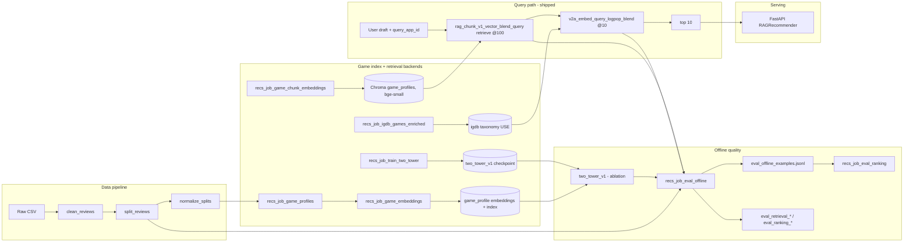

# Project summary

Single-page orientation for the **Steam Recommendations** repository: what it is, how it is organized, and where to go next.

For run commands and artifact paths, prefer [`usage_pipeline.md`](usage_pipeline.md). For prioritized work, see [`project_todo_plan.md`](project_todo_plan.md).

---

## What this is

An applied ML portfolio project that builds a **production-oriented Steam game recommender** from review and metadata signals. The current system is **retrieval-first**: embed game profiles and user queries, retrieve candidates by similarity, optionally blend in history-aware signals, evaluate offline with ranking metrics, and serve recommendations through a **FastAPI** app.

The repo is meant to show **clear metric definitions**, **reproducible experiments**, and a path from **notebooks → library code → scripted jobs → API**.

---

## Product intent

End-user flow (see [`product_vision_recommender_and_review_coaching.md`](product_vision_recommender_and_review_coaching.md)):

1. User writes a **draft review** (or preference text).
2. **Preference extraction** turns it into structured taste + embedding-ready text (rules v0 in code; LLM optional later).
3. **Retrieval** returns top-K games from a content index.
4. **Review coaching** (optional, separate module) is out of scope for the default retrieval path.

**North star:** content-led **v1** retrieval with **raw** embeddings as default until **structured** beats raw on validation; then **v2** hybrid reranking (metadata, popularity, optional tabular scores). Collaborative filtering (ALS) is deferred until the content baseline is solid.

---

## Data

| Item | Detail |
|------|--------|
| **Source** | [Steam Reviews 2021 (Kaggle, najzeko)](https://www.kaggle.com/datasets/najzeko/steam-reviews-2021) |
| **Raw location** | `data/raw/` |
| **Interim** | Cleaned Parquet, train/val/test splits under `data/interim/` |
| **Processed** | Normalized feature Parquets + params under `artifacts/` |

**Split policy** (`configs/split_reviews.json`): **support-aware user-temporal** split — users with exactly 1 review get a random assignment matching the global 70/20/10 ratios; users with ≥2 reviews get a per-user coin flip that picks one eval split (val or test, never both), then their most-recent `max(2, round(n·eval_ratio))` reviews all go there, with the rest going to train. Seed: `PROJECT_RANDOM_SEED` in `steam_review_ml.constants` (override via `STEAM_REVIEWS_RANDOM_STATE`).

---

## Repository layout

```text
steam_recommendations/
  configs/              # JSON job configs (clean, split, normalize, recs jobs)
  data/
    raw/                # Kaggle download (not in git)
    interim/            # cleaned + split Parquets
    processed/          # normalized modeling tables
  docs/                 # runbooks, metrics, roadmap, this file
  notebooks/
    eda/                # exploratory analysis (eda_001–010)
    etl/                # cleaning / split / normalization validation
    models/
      tabular/          # recommended + votes_helpful baselines / simple models
      game_embeddings/  # recs_001–002 game profiles + index vectors
      query_embeddings/ # recs_003–007 query methods, ablations, qual eval
    retrieval/  # history blend, pipeline parity, two-tower, central eval
  scripts/              # CLI entry points for pipeline + recs jobs
  src/steam_review_ml/  # installable package
  tests/                # preprocess, evaluation, regression baselines
  artifacts/recs/       # embeddings, offline eval runs, experiments (see artifact_layout)
```

---

## Python package (`steam_review_ml`)

| Module | Role |
|--------|------|
| `data/` | Streaming loaders, filters, feature selection, Parquet export |
| `transforms/` | Normalization rules for tabular features |
| `recommender/` | `ContentRetriever`, `Recommender` ABC with `RAGRecommender` (shipped v2a stack) and `TwoTowerRecommender`, preference extraction |
| `evaluation/` | Offline retrieval/ranking eval orchestration (`retrieval_offline_eval.py`), shared metrics; Stage 4/5 explanation eval — heuristic proxies (`explanation_eval_pipeline.py`), LLM-as-judge (`llm_judge.py`), human-label calibration (`judge_calibration.py`) |
| `api/` | FastAPI app: `/recommendations`, `/explain`, `/ui`, `/games`, `/health` (optional extra `.[api]`); `serving_log.py` appends every `/recommendations`/`/explain` response to `artifacts/recs/serving_logs/events.jsonl` |
| `constants.py` | Project-wide random seed |

**Install:** `pip install -e .` (core). Recommender notebooks and `ContentRetriever` need TensorFlow + TF Hub (typically conda-forge). API: `pip install -e ".[api]"`.

---

## System flow



1. **Ingest:** filter reviews, split users, normalize numeric features.
2. **Index:** aggregate thumbs-up review text per game → embed (bge-small chunk index for RAG retrieval; USE-based two-tower kept for ablation); build IGDB enriched taxonomy features for v2a.
3. **Retrieve + rerank:** `rag_chunk_v1_vector_blend_query` @100 → `two_tower_v1_v2a_embed_query_logpop_blend` @10 (query-game IGDB anchor + D1 log-pop blend). `two_tower_v1` retrieval remains available for ablation/rollback (`TwoTowerRecommender`), not the shipped path.
4. **Evaluate:** scripted jobs score methods and write contract tables under `artifacts/recs/offline_eval/runs/latest/`.
5. **Serve:** `RAGRecommender` exposed over FastAPI (`method=v2a` default; `method=raw` ablation). **`exclude_app_id`** required for v2a (game being reviewed). Top-pick "why" text is a separate, non-blocking `GET /explain` call (Stage 4 local-LLM explanation, grounded in both games' IGDB text, not the user's review); every live `/recommendations`/`/explain` response is logged to `artifacts/recs/serving_logs/events.jsonl`, raw material for a future pass over *live* traffic. A separate, already-built offline harness LLM-judges explanations generated over an *eval cohort* (`recs_job_explanation_judge_eval.py`) and calibrates the judge against hand labels (`recs_job_explanation_judge_calibration.py`) — see [`plans/rag_extension_plan.md`](plans/rag_extension_plan.md) Stage 5 Track B.

---

## Modeling lanes

| Lane | Status | Notes |
|------|--------|-------|
| **Primary — recommendations** | v1 near complete | Game index, raw-default retrieval, val eval contract, dev API |
| **Supporting — tabular** | Baselines done | `recommended` classification, `votes_helpful` regression; feeds analysis and future v2 features |
| **Next — two-tower + ranker** | **v2a ranker shipped** | `two_tower_v1` @100 → `two_tower_v1_v2a_embed_query_logpop_blend` @10 beats D1 and `popularity_train` on ranking contract (`runs/latest_ranking`) |

**Default retrieval:** raw review text embeddings beat structured preference rewrites on validation proxy tasks (`recs_004`, `recs_006`). Structured path remains an explicit ablation.

**Known limitation:** pooling heterogeneous likes into one query vector (mean / time-weighted) assumes a single taste direction; multi-interest users can get vague recommendations (documented in root `README.md`).

---

## Key scripts

| Script | Purpose |
|--------|---------|
| `scripts/clean_reviews.py` | Raw CSV → cleaned Parquet |
| `scripts/split_reviews.py` | Cleaned → train/val/test |
| `scripts/normalize_split_parquets.py` | Interim splits → `_norm` processed tables |
| `scripts/recs_job_game_profiles.py` | Build per-game review profile tables |
| `scripts/recs_job_game_embeddings.py` | Embed game profiles → index artifacts |
| `scripts/recs_job_build_eval_examples.py` | Cache offline eval cohorts |
| `scripts/recs_job_eval_offline.py` | Full offline eval: re-score methods → `eval_retrieval_*` + `eval_ranking_*` + pools jsonl |
| `scripts/recs_job_eval_ranking.py` | Rank-only eval: frozen pools → rerank vs `popularity_train` (`runs/latest_ranking`) |
| `scripts/recs_job_igdb_games.py` | Fetch IGDB metadata + join to Steam catalog → `artifacts/igdb/` |
| `scripts/recs_migrate_artifacts_layout.py` | Move legacy artifact paths |

Configs live beside each job under `configs/`.

---

## Notebooks (by track)

| Track | Examples | Question |
|-------|----------|----------|
| **EDA / ETL** | `eda_001`–`010`, `eda_008_clean_pipeline` | Targets, quality, features, cleaning validation |
| **Tabular** | `model_000`–`002` | Dumb baselines, linear/logistic models |
| **Game index** | `recs_001`, `recs_002`, `recs_005` | Profiles, raw vs structured game vectors |
| **Query / representation** | `recs_003`–`007`, `recs_004_*` | Smoke retrieval, same-user proxy, 4-way ablation, qual |
| **Retrieval orchestration** | `recs_008`–`012`, `recs_011` (retrieval) | History blend, pipeline parity, two-tower comparison, training-row explore |
| **Ranking** | `recs_011` (viewer), `recs_013`–`recs_021` | View `latest_ranking` eval; v2a metadata ranker spikes + head-to-head |

Metric definitions: [`retrieval_metrics_guide.md`](retrieval_metrics_guide.md). Eval contract and notebook map: [`recommendation_evaluation_overview.md`](recommendation_evaluation_overview.md).

---

## Artifacts

Standard layout under `artifacts/recs/` — see [`artifact_layout.md`](artifact_layout.md).

- **`embeddings/game_profile/`** — Parquet profiles, `.npz` vectors, index metadata
- **`offline_eval/runs/latest/`** — retrieval job: `eval_retrieval_*`, shared `eval_offline_examples.jsonl`
- **`offline_eval/runs/latest_ranking/`** — ranking job: `eval_ranking_*` (rerank vs `popularity_train`)
- **`eval_cache/`** — frozen eval example cohorts
- **`experiments/`** — one-off study outputs (e.g. 4-way proxy, history blend)

---

## Tests and regression

```bash
python -m pytest -q tests/test_preprocess.py tests/test_evaluation.py
python -m pytest -q tests/test_recs_006_regression.py
python -m pytest -q tests/test_retrieval_eval_regression.py
```

Refresh retrieval eval baseline after intentional metric changes:

```bash
python scripts/recs_job_eval_offline.py configs/recs_job_eval_offline.json --write-baseline
```

---

## Documentation map

| Doc | Use when |
|-----|----------|
| [`README.md`](../README.md) | Portfolio snapshot, headline offline numbers, quick links |
| [`usage_pipeline.md`](usage_pipeline.md) | Step-by-step commands |
| [`project_todo_plan.md`](project_todo_plan.md) | What is done vs next |
| [`retrieval_decision_log.md`](retrieval_decision_log.md) | Why the current default retrieval recipe won |
| [`docs/README.md`](README.md) | Full index of all docs |

---

## Current focus (June 2026)

1. **V2b summary similarity** — next ranker spike on frozen pools; beat shipped v2a or kill (`recommender_v2_plan.md`).
2. **Two-tower retrieval** — improve pool oracle ceiling (ranker already beats popularity despite lower oracle). Runbook: [`two_tower_pipeline_plan.md`](two_tower_pipeline_plan.md).
3. **Eval housekeeping** — refresh baseline (`--write-baseline`), re-export experiment registry after eval runs.

**Headline result (ranking gate):** `two_tower_v1_v2a_embed_query_logpop_blend` beats D1 and `popularity_train` on NDCG@10 overall and Slice A — viewer: [`recs_011_view_offline_ranking_eval.ipynb`](../notebooks/evaluation/recs_011_view_offline_ranking_eval.ipynb).

Parked until API leaves trusted/local use: auth, rate limits, deploy hardening.
