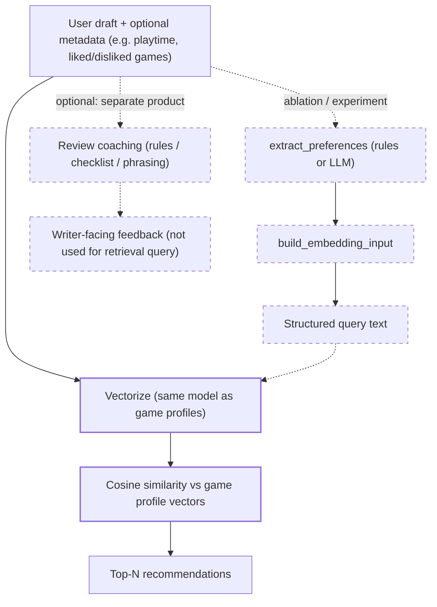
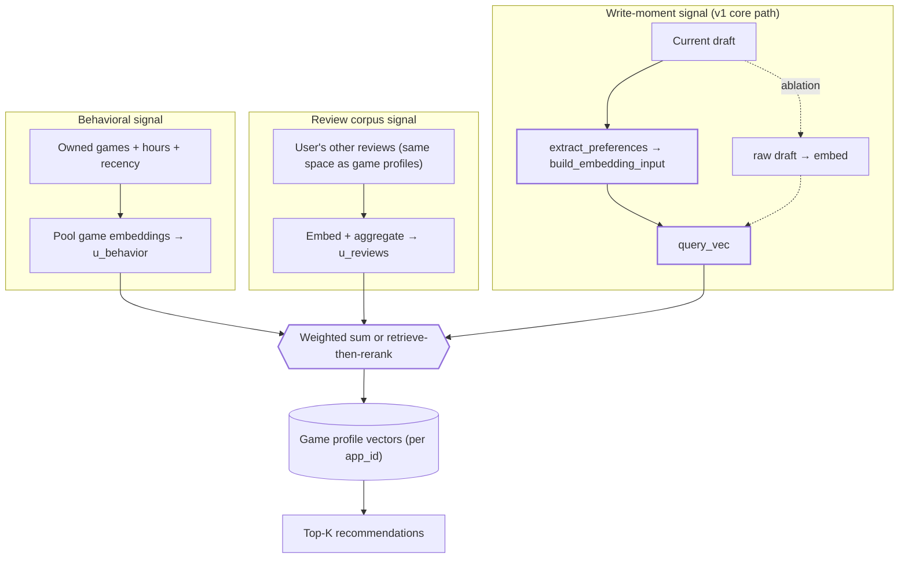

# Recommender Transition Plan

Product positioning — **preference extraction + recommendations are core**; **review coaching is optional** and a **separate** system (writer feedback, not the retrieval query). Details: `[product_vision_recommender_and_review_coaching.md](product_vision_recommender_and_review_coaching.md)`.

Phased work across the whole repo (data pipeline, tabular models, recommender, API) is tracked in `**[project_todo_plan.md](project_todo_plan.md)`**. That doc uses the **same priority**: **preference extraction + recommender v1 → @K eval** is the primary execution lane; tabular `recommended` / `votes_helpful` models are **supporting** signals for analysis and **v2 hybrid** reranking, not a substitute for extraction + retrieval.

## North star (single lane)

We commit to **one ordering** so content retrieval and collaborative filtering are not competing “religions”:


| Version | Role                                                                                                                                                   | Collaborative / ALS                                                                                                                                                                       |
| ------- | ------------------------------------------------------------------------------------------------------------------------------------------------------ | ----------------------------------------------------------------------------------------------------------------------------------------------------------------------------------------- |
| **v1**  | **Content retrieval** vs game-profile vectors: **default query = embed raw review text** (USE) until **structured** extraction wins on **validation** proxy metrics (`recs_004`); structured path = `extract_preferences` → `build_embedding_input` → embed (ablation / stress-query tool today). | **Out of scope for v1.**                                                                                                                                                                  |
| **v2**  | **Hybrid ranking** on the **same candidate set** as v1: rerank with blended signals.                                                                   | **Planned upgrade:** ALS or item–item factors are **one** optional term alongside popularity, metadata, similarity priors, and optional tabular model scores — not a parallel v1 product. |


**ALS is deferred** until after v1 retrieval and @K evaluation are in place and you have characterized user–item sparsity. Until then, the thesis is **content-led**.

## Current state vs goal

**Tabular models in the repo** (see `notebooks/models/tabular/`) predict:

- `**recommended`** — classification (e.g. logistic regression on numeric/normalized features; dumb baselines in `model_000`).
- `**votes_helpful**` — regression, often on `**_norm_votes_helpful**` (dumb baselines + linear regression in `model_000` / `model_001`).

`**is_helpful**` is **not** a separate modeling target; it is **derived** from `votes_helpful` (e.g. `>= 1`).

Those tasks are useful for **analysis** and optional **v2 rerank features**. The recommender must still answer **"What should this user try next?"** — that requires **retrieval**, not tabular review prediction alone.

## Recommended architecture (2 stages)

Same pattern for v1 and v2; v2 enriches stage 2 only.

1. **Candidate generation**
  - Produce a shortlist of possible games.
  - **v1:** **Embed the user’s review text (raw)** and match to **game profiles** — current **default** for USE + the **val same-user proxy** in `recs_004` (rules-based structured underperforms raw there). **Structured** text (`extract_preferences` + `build_embedding_input`) remains the **comparison / ablation** path until it **beats raw on validation** (or for targeted negation-heavy queries).
  - **v2 (optional):** widen or dedupe candidates if you add multiple generators; primary v1 path can remain similarity-based top‑M.
2. **Ranking / scoring**
  - Re-rank candidates using blended signals.
  - **v1:** can be identity rank (pure similarity) or light tweaks (e.g. popularity prior).
  - **v2:** hybrid scores — e.g. text similarity + **ALS / co-occurrence** + popularity + metadata + optional `p(recommended)` / helpfulness features.

Example blended score (illustrative only; tune on validation):

`rank_score = w1 * text_similarity + w2 * als_or_item_score + w3 * popularity_prior + ...`

## Phase 1 — v1 MVP (content-based recommender)

### Inputs

- User free-text review
- Optional lightweight metadata (e.g., playtime)

### Artifacts to build

- **Per-review profile table** (train, thumbs-up only): `artifacts/recs/game_profile_reviews.parquet` — one row per review; capped per game. **Game vector:** embed each row, **mean-pool per `app_id`**, L2-normalize (`recs_002`).

**Notebooks:** `recs_001_game_profiles.ipynb` → `game_profile_reviews.parquet`. `recs_002_embed_game_profiles.ipynb` → `game_profile_embeddings.npz` + index Parquet. `recs_003_query_retrieve.ipynb` → query embed + top‑K (demo; see `docs/usage_pipeline.md`). `recs_004_eval_same_user_proxy.ipynb` → val proxy metrics (**raw vs structured**, random + popularity baselines, optional multi-review pooling).

- `vectorizer.pkl` (or embedding model reference)

### Online flow

**Default retrieval query (v1, USE + current metrics):** **embed the raw draft / review** → cosine similarity vs game profiles → top‑N. Validated against the **held-out same-user likes** proxy on **val** in `recs_004`; **rules-based** structured text currently **trails** raw there.

**Structured path (ablation / product experiment):** `extract_preferences` (heuristic today; LLM optional later) → `build_embedding_input` → embed → same retrieval. Keep improving extraction and **re-check on val** before promoting structured to default.

**Evaluation / ablation:** compare **raw → embed** vs **structured → embed** (and baselines) on **val**; reserve **test** for a final frozen run. `recs_004` adds **random** and **train popularity** baselines.

**Raw vs structured (explicit):**

- **Raw query** = embed the user draft as-is (**default** until structured wins on validation).
- **Structured query** = run `extract_preferences` then `build_embedding_input`, and embed that normalized preference text (**ablation** / targeted use cases).

**Negative preference handling (without external tags/metadata):**

- Do not interpret lowest cosine as "opposite taste".
- Use a positive+negative query formulation, e.g. `score = sim(q_pos, game) - lambda * sim(q_neg, game)`.
- If adding a dual-index (`game_pos`, `game_neg`), sample/balance negatives carefully (caps/ratios) to avoid noisy/event-driven complaints dominating game vectors.

**Review coaching** is **not** this step. It is an **optional**, **separate** product feature: feedback to help the user **write** a better review (rules, checklist, phrasing). It must **not** be conflated with preference extraction; do not use coaching output as the retrieval query unless you deliberately merge them (out of scope for the default design).



## User representation beyond the current review (planned extension)

The **default v1 retrieval path** today is **raw draft → embed** → cosine vs per-game profile vectors (see **Online flow** above). You also have **library / playtime / recency** and **the user’s other Steam reviews**. Those belong in the **same embedding space** as game profiles so you can combine **long-term taste**, **how the user writes about games**, and **this session’s intent** (`recs_004` §4 experiments with **multi-review** pooling on val).

**Three complementary signals**

1. **Behavioral user vector** — aggregate **game embeddings** over owned / played titles with weights from hours, recency, and engagement (vs backlog). Encodes *what they actually spend time in*.
2. **Review-history user vector** — same pipeline as game profiles: embed **this user’s past reviews** (chunks or full text), then pool (mean, weighted by recency, etc.). Encodes *language and themes* behavior alone can miss.
3. **Session query vector** — **current review** text or `build_embedding_input` output. Encodes *what they are judging right now* and steers retrieval within broad taste.

**Fusion (implementation choices, still content-based)**

- **Single retrieval:** e.g. `q_eff = normalize(α·u_behavior + β·u_reviews + γ·q_session)` then cosine vs game vectors (tune α, β, γ; shrink β or γ when history is sparse).
- **Two-stage:** retrieve top‑M with **u_behavior** or **u_reviews**, then **rerank** with **q_session** (clear separation of “habit” vs “this review’s angle”).

This remains **content-led**: no ALS required. It is **orthogonal** to **v2 hybrid** in this doc (tabular scores, optional ALS, priors)—those are extra **ranking** terms; user vectors are extra **retrieval / rerank** context in embedding space.

**Cold start:** When hours or past reviews are few, rely more on **q_session** (and optional popularity priors already mentioned for v1). When history is rich, **u_behavior** and **u_reviews** stabilize recommendations and reduce overfitting to a single draft.



This creates a true recommender quickly and matches the **write-a-review** moment; the extension above adds **portfolio- and history-aware** context without changing the north star of **embedding-based retrieval vs game profiles**.

## Phase 2 — v2 (hybrid ranking)

Rerank **the same candidates** (or a slightly enlarged pool) using multiple signals. **ALS or matrix factorization on implicit feedback** is an optional component here — not the v1 thesis.

Possible ranking features:

- text similarity (from v1)
- collaborative / ALS user–item or item–item score (when added)
- `p(recommended)`, expected `votes_helpful` (or scores from the helpful-votes model; a binary “any helpful vote” view is **derived** from the count if needed)
- popularity / volume priors
- metadata (tags, genres) if available

Tune weights on validation data.

## Evaluation shift (important)

Keep existing prediction metrics, but make recommender metrics primary:

- Precision@K
- Recall@K
- MAP@K
- NDCG@K

Also track:

- recommendation coverage/diversity
- popularity bias
- per-game / per-segment quality

### Offline proxy task: other games the same user liked

The dataset is **multi-review**: many users have reviewed more than one game. That supports a **concrete relevance definition** without LLM labels or live traffic:

1. **Positive labels (per evaluation example)** — For user *u*, pick a **query review** (text of one of their reviews, optionally the game under review as context you exclude from candidates). Treat **other games *u* reviewed with `recommended == true`** (thumbs-up) as **relevant** items for retrieval—held out so they are not the query game.
2. **Query** — Embed that review (raw or structured path). Retrieve top‑K over the **game index** (excluding the query `app_id`).
3. **Metrics** — **Recall@K**, **HitRate@K**, **MRR**, **NDCG@K** if you add graded relevance (e.g. weight by `votes_helpful` only as a *secondary* experiment—mind leakage and “helpful ≠ good rec”).
4. **Splits** — Hold out by **user** or **time** so you are not evaluating on the same review-generation process you “trained” heuristics on; cap how many positives exist per user so metrics are interpretable.

**Caveats (call these out in any write-up):** sparse users (one review only → skip or use global baselines); **franchise / sequel** correlation; **cold users**; positives are **retrospective** (“they liked it enough to review”) not **counterfactual** (“they would have liked a suggestion”).

**Split hygiene:** `recs_004` reads query rows from **`steam_reviews_cleaned_english_val_norm.parquet`** so **test** stays a true final holdout. Use **`test_norm`** only for a **one-shot** report after you freeze the method.

**Baselines in `recs_004`:** **random** ranking (query game masked) and **popularity** (train thumbs-up counts per `app_id`) contextualize raw vs structured scores.

This proxy is **aligned with content-based retrieval** you already built: if neighbor games in embedding space match **other likes** of the same user, the pipeline is doing something right—compare **raw vs structured vs negative-penalty** on the **same** held-out sets.

## Concrete next tasks (execution order)

**Tabular baselines and simple linear models** already exist under `notebooks/models/tabular/` (`model_000_*`, `model_001_*`, `model_002_*`). They **do not** satisfy the items below; the **north star** remains **preference extraction + content retrieval + @K** for recommendations. **Game index:** `recs_001` → `game_profile_reviews.parquet`; `recs_002` → embedding matrix; `recs_003` → query + top‑K smoke test.

**v1**

1. ~~Build `**game_profile_reviews.parquet`** from training reviews (`recs_001`), then **per-game vectors** (`recs_002`).~~ **Done** (see `docs/project_todo_plan.md` checklist).
2. Implement **preference extraction** + `build_embedding_input` (**ablation** path); **default** retrieval embed = **raw** text until structured wins on **val** (`recs_004`).
3. **Demo done:** `recs_003` — retrieval + **§9** raw vs structured vs negative penalty. **`recs_004`** — val proxy vs **random** + **popularity** baselines; optional **multi-review** pooling.
4. Evaluate with @K metrics; document vs. baselines; **raw vs structured** on val proxy (and fixed drafts as needed).
5. Run an A/B matrix on fixed drafts: raw+positive-only, structured+positive-only, raw+dual-index, structured+dual-index (if dual-index is available).

**v2 (after v1 baseline exists)**

1. Add hybrid ranking (start with priors + metadata; add ALS when data/process justify it).
2. Optionally fold in `recommended` / helpfulness model scores as features.
3. Add a simple API endpoint for recommendations if not already present.
4. Iterate on weights/features and document findings.

## Pseudocode sketch (MVP retrieval)

```python
# Default path (today): raw draft -> vectorize -> cosine similarity -> top_k
# user_vec = vectorizer.transform([user_text])
# sims = cosine_similarity(user_vec, game_profile_matrix).ravel()
# top_idx = np.argsort(-sims)[:10]
# recommendations = game_profiles.iloc[top_idx][["app_id", "app_name"]]

# Ablation: structured preferences -> same retrieval
# prefs = extract_preferences(user_text, optional_context)
# query_text = build_embedding_input(prefs)
# user_vec = vectorizer.transform([query_text])
```

## Idea only (not adopting): two query embeddings

**Status:** recorded for later reference. **v1 stays as-is:** one structured preference paragraph → one query embedding → cosine vs game profiles.

Some teams split the user side into **two strings** embedded with the same model—e.g. positive intent vs things to avoid—then rank with something like `score = sim(q_pos, game) - λ * sim(q_neg, game)` (two dot products against the same game matrix; `recs_003` sketches this as `rank_with_negative_penalty`). That pushes negation to the **scoring** step instead of asking a single embedding to reconcile praise and criticism.

We are **not** pursuing this path for now; single-query structured retrieval remains the default product and eval setup.

