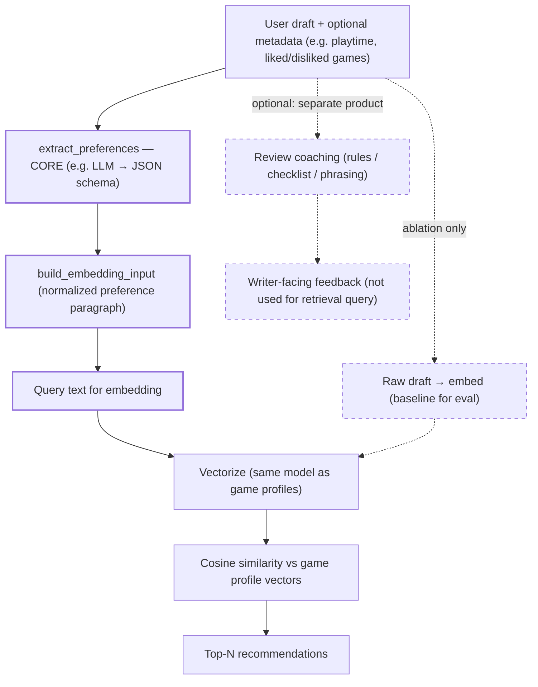

# Recommender Transition Plan

Product positioning — **preference extraction + recommendations are core**; **review coaching is optional** and a **separate** system (writer feedback, not the retrieval query). Details: `[product_vision_recommender_and_review_coaching.md](product_vision_recommender_and_review_coaching.md)`.

Phased work across the whole repo (data pipeline, tabular models, recommender, API) is tracked in `**[project_todo_plan.md](project_todo_plan.md)`**. That doc uses the **same priority**: **preference extraction + recommender v1 → @K eval** is the primary execution lane; tabular `recommended` / `votes_helpful` models are **supporting** signals for analysis and **v2 hybrid** reranking, not a substitute for extraction + retrieval.

## North star (single lane)

We commit to **one ordering** so content retrieval and collaborative filtering are not competing “religions”:


| Version | Role                                                                                                                                                   | Collaborative / ALS                                                                                                                                                                       |
| ------- | ------------------------------------------------------------------------------------------------------------------------------------------------------ | ----------------------------------------------------------------------------------------------------------------------------------------------------------------------------------------- |
| **v1**  | **Preference extraction** (draft → structured taste) → **embed the structured query** → **content retrieval** vs game-profile vectors → similar games. | **Out of scope for v1.**                                                                                                                                                                  |
| **v2**  | **Hybrid ranking** on the **same candidate set** as v1: rerank with blended signals.                                                                   | **Planned upgrade:** ALS or item–item factors are **one** optional term alongside popularity, metadata, similarity priors, and optional tabular model scores — not a parallel v1 product. |


**ALS is deferred** until after v1 retrieval and @K evaluation are in place and you have characterized user–item sparsity. Until then, the thesis is **content-led**.

## Current state vs goal

**Tabular models in the repo** (see `notebooks/models/tabular/`) predict:

- `**recommended`** — classification (e.g. logistic regression on numeric/normalized features; dumb baselines in `model_000`).
- `**votes_helpful**` — regression, often on `**_norm_votes_helpful**` (dumb baselines + linear regression in `model_000` / `model_001`).

`**is_helpful**` is **not** a separate modeling target; it is **derived** from `votes_helpful` (e.g. `>= 1`).

Those tasks are useful for **analysis** and optional **v2 rerank features**. The recommender must still answer **"What should this user try next?"** — that requires **retrieval**, not tabular review prediction alone.

## Recommended architecture (2 stages)

Same pattern for v1 and v2; v2 enriches stage 2 only.

1. **Candidate generation**
  - Produce a shortlist of possible games.
  - **v1:** **Structured preference text** (from `extract_preferences` + `build_embedding_input`) embedded and matched to **game profiles** — not raw draft embedding as the default product path. (You may still use raw-text embedding for **baselines / A–B evaluation**.)
  - **v2 (optional):** widen or dedupe candidates if you add multiple generators; primary v1 path can remain similarity-based top‑M.
2. **Ranking / scoring**
  - Re-rank candidates using blended signals.
  - **v1:** can be identity rank (pure similarity) or light tweaks (e.g. popularity prior).
  - **v2:** hybrid scores — e.g. text similarity + **ALS / co-occurrence** + popularity + metadata + optional `p(recommended)` / helpfulness features.

Example blended score (illustrative only; tune on validation):

`rank_score = w1 * text_similarity + w2 * als_or_item_score + w3 * popularity_prior + ...`

## Phase 1 — v1 MVP (content-based recommender)

### Inputs

- User free-text review
- Optional lightweight metadata (e.g., playtime)

### Artifacts to build

- **Per-review profile table** (train, thumbs-up only): `artifacts/recs/game_profile_reviews.parquet` — one row per review; capped per game. **Game vector:** embed each row, **mean-pool per `app_id`**, L2-normalize (`recs_002`).

**Notebooks:** `recs_001_game_profiles.ipynb` → `game_profile_reviews.parquet`. `recs_002_embed_game_profiles.ipynb` → `game_profile_embeddings.npz` + index Parquet. `recs_003_query_retrieve.ipynb` → query embed + top‑K (demo; see `docs/usage_pipeline.md`).

- `vectorizer.pkl` (or embedding model reference)

### Online flow

**Core product path (v1):** `extract_preferences` (e.g. LLM → structured JSON) → `build_embedding_input` → **embed that string** → cosine similarity vs game profiles → top‑N. Noisy drafts become **high-signal query text** before vectorization.

**Evaluation / ablation:** compare **raw draft → embed** vs **structured prefs → embed** on a fixed test set; improve extraction if the structured path does not win.

**Review coaching** is **not** this step. It is an **optional**, **separate** product feature: feedback to help the user **write** a better review (rules, checklist, phrasing). It must **not** be conflated with preference extraction; do not use coaching output as the retrieval query unless you deliberately merge them (out of scope for the default design).




This creates a true recommender quickly and matches the **write-a-review** moment.

## Phase 2 — v2 (hybrid ranking)

Rerank **the same candidates** (or a slightly enlarged pool) using multiple signals. **ALS or matrix factorization on implicit feedback** is an optional component here — not the v1 thesis.

Possible ranking features:

- text similarity (from v1)
- collaborative / ALS user–item or item–item score (when added)
- `p(recommended)`, expected `votes_helpful` (or scores from the helpful-votes model; a binary “any helpful vote” view is **derived** from the count if needed)
- popularity / volume priors
- metadata (tags, genres) if available

Tune weights on validation data.

## Evaluation shift (important)

Keep existing prediction metrics, but make recommender metrics primary:

- Precision@K
- Recall@K
- MAP@K
- NDCG@K

Also track:

- recommendation coverage/diversity
- popularity bias
- per-game / per-segment quality

## Concrete next tasks (execution order)

**Tabular baselines and simple linear models** already exist under `notebooks/models/tabular/` (`model_000_*`, `model_001_*`, `model_002_*`). They **do not** satisfy the items below; the **north star** remains **preference extraction + content retrieval + @K** for recommendations. **Game index:** `recs_001` → `game_profile_reviews.parquet`; `recs_002` → embedding matrix; `recs_003` → query + top‑K smoke test.

**v1**

1. ~~Build `**game_profile_reviews.parquet`** from training reviews (`recs_001`), then **per-game vectors** (`recs_002`).~~ **Done** (see `docs/project_todo_plan.md` checklist).
2. Implement **preference extraction** + `build_embedding_input` (core query path); keep **raw-embed** only for **A/B** vs structured query.
3. **Demo done:** `recs_003` — similarity retrieval + top‑K with a **hand-written** query. **Still to do:** same pipeline with **structured** query from step 2.
4. Evaluate with @K metrics; document vs. simple baselines (e.g. popularity); include **raw vs structured embedding** comparison on fixed drafts.

**v2 (after v1 baseline exists)**

1. Add hybrid ranking (start with priors + metadata; add ALS when data/process justify it).
2. Optionally fold in `recommended` / helpfulness model scores as features.
3. Add a simple API endpoint for recommendations if not already present.
4. Iterate on weights/features and document findings.

## Pseudocode sketch (MVP retrieval)

```python
# Core path: structured preferences -> vectorize -> cosine similarity -> top_k
# prefs = extract_preferences(user_text, optional_context)
# query_text = build_embedding_input(prefs)
# user_vec = vectorizer.transform([query_text])
# sims = cosine_similarity(user_vec, game_profile_matrix).ravel()
# top_idx = np.argsort(-sims)[:10]
# recommendations = game_profiles.iloc[top_idx][["app_id", "app_name"]]

# Ablation: same pipeline with query_text = user_text (raw draft)
```

