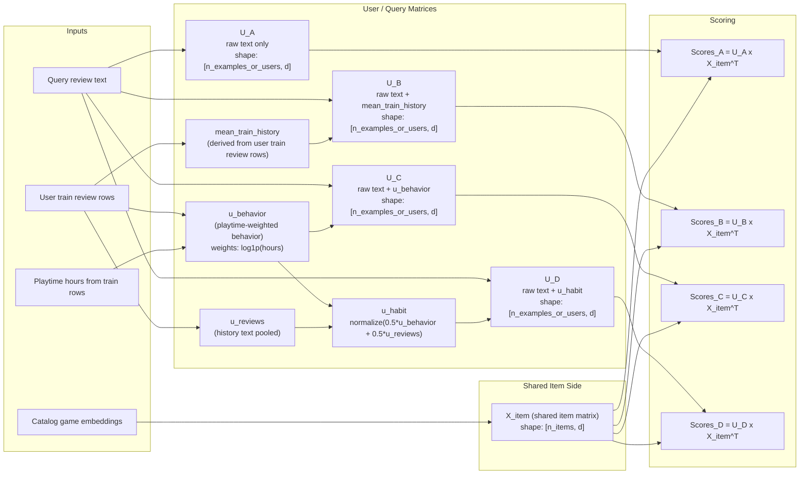

# Retrieval Embedding Matrices (Current Plan)

```mermaid
flowchart LR
    subgraph INPUTS[Inputs]
        QA[Query review text]
        TRAIN_ROWS[User train review rows]
        PT[Playtime hours from train rows]
        IG[Catalog game embeddings]
    end

    subgraph ITEM_SIDE[Shared Item Side]
        XI["X_item (shared item matrix)\nshape: [n_items, d]"]
    end

    subgraph USER_SIDE[User / Query Matrices]
        UA["U_A\nraw text only\nshape: [n_examples_or_users, d]"]
        MTB["mean_train_history\n(derived from user train review rows)"]
        UB["U_B\nraw text + mean_train_history\nshape: [n_examples_or_users, d]"]
        UREV["u_reviews\n(history text pooled)"]
        UBEH["u_behavior\n(playtime-weighted behavior)\nweights: log1p(hours)"]
        UC["U_C\nraw text + u_behavior\nshape: [n_examples_or_users, d]"]
        UHAB["u_habit\nnormalize(0.5*u_behavior + 0.5*u_reviews)"]
        UD["U_D\nraw text + u_habit\nshape: [n_examples_or_users, d]"]
    end

    subgraph SCORING[Scoring]
        SA["Scores_A = U_A x X_item^T"]
        SB["Scores_B = U_B x X_item^T"]
        SC["Scores_C = U_C x X_item^T"]
        SD["Scores_D = U_D x X_item^T"]
    end

    IG --> XI

    QA --> UA
    QA --> UB
    QA --> UC
    QA --> UD

    TRAIN_ROWS --> MTB
    TRAIN_ROWS --> UREV
    TRAIN_ROWS --> UBEH
    PT --> UBEH

    MTB --> UB
    UBEH --> UC
    UBEH --> UHAB
    UREV --> UHAB
    UHAB --> UD

    UA --> SA
    UB --> SB
    UC --> SC
    UD --> SD

    XI --> SA
    XI --> SB
    XI --> SC
    XI --> SD
```
