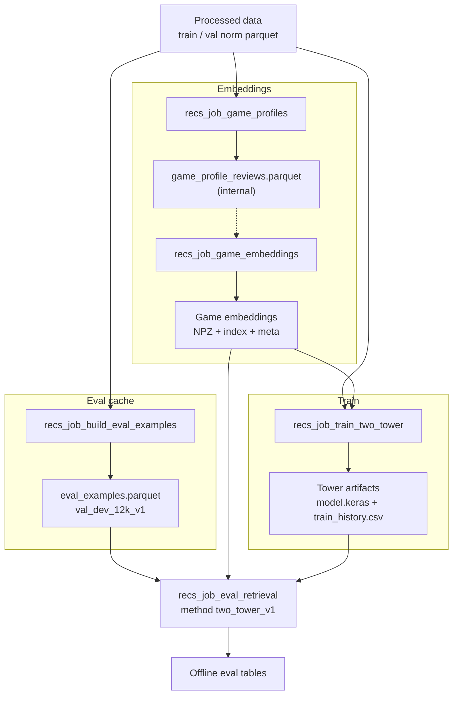

# Two-tower pipeline plan (script-only)

Status: active  
Last reviewed: 2026-05-24

Script-only runbook for **trained two-tower retrieval** (`updated_user__updated_profile200_item`). Exploratory notebooks (`recs_012_task_A`, etc.) are not part of production runs.

**Related:** [`usage_pipeline.md`](usage_pipeline.md) (data + recommender steps), [`recommendation_evaluation_overview.md`](recommendation_evaluation_overview.md) (Task A eval contract).

---

## Design choices

| Choice | Decision |
|--------|----------|
| **Train job reads** | **Game embeddings** (`ContentRetriever` / NPZ + index + meta) — **not** `game_profile_reviews.parquet` |
| **Item init** | Rows from `embedding_matrix` (catalog); profile parquet is only input to the embeddings job |
| **Training labels** | `build_contrastive_examples(split="train")` — same-split positives (not the offline eval job API) |
| **Benchmark eval** | Cached `eval_examples.parquet` + `recs_job_eval_retrieval.py` with method `two_tower_v1` |
| **Production model** | Single architecture: trainable USE user tower + trainable item tower |

Profiles parquet is an **internal** artifact between `recs_job_game_profiles` and `recs_job_game_embeddings`. The train job does not open it.

---

## Pipeline (swimlanes)



---

## Per-job artifacts

| Job | Reads | Writes |
|-----|-------|--------|
| `recs_job_game_profiles` | train norm parquet | `game_profile_reviews.parquet` |
| `recs_job_game_embeddings` | profiles parquet | game embeddings (NPZ + index + meta) |
| `recs_job_build_eval_examples` | val norm parquet + cohort config | `eval_examples.parquet` |
| `recs_job_train_two_tower` | train/val parquet + game embeddings | `*.keras`, `train_history.csv`, `run_metadata.json` |
| `recs_job_eval_retrieval` | eval cache + embeddings + tower model | `eval_retrieval_*`, `eval_ranking_*`, jsonl |

**Library modules:** `steam_review_ml.recommender.contrastive_examples`, `two_tower_train`, `two_tower_score`.

---

## Train job internals

**Reads**

- `build_contrastive_examples(split="train"|"val")` from [`contrastive_examples.py`](../src/steam_review_ml/recommender/contrastive_examples.py)
- Game embeddings via `ContentRetriever`
- `item_init` ← `embedding_matrix` only

**Trains**

- User: trainable USE → 64-d projection
- Item: trainable `item_base` (catalog init) → 64-d projection
- Multi-positive in-batch contrastive loss; early stopping on val contrastive loss

**Writes** (under `artifacts/recs/towers/<run_tag>/`)

- `updated_user__updated_profile200_item.keras`
- `train_history.csv`
- `run_metadata.json`

---

## Commands (no notebooks)

```bash
python scripts/recs_job_game_profiles.py configs/recs_job_game_profiles.json
python scripts/recs_job_game_embeddings.py configs/recs_job_game_embeddings.json
python scripts/recs_job_build_eval_examples.py configs/recs_job_build_eval_examples.json
python scripts/recs_job_train_two_tower.py configs/recs_job_train_two_tower.json
```

Benchmark eval with trained tower (add `two_tower_v1` to `methods` and set `two_tower_model_path` in config):

```bash
python scripts/recs_job_eval_retrieval.py configs/recs_job_eval_retrieval.json \
  --examples-parquet artifacts/recs/eval_cache/val_dev_12k_v1/eval_examples.parquet
```

Example config keys:

```json
"methods": ["raw", "popularity_train", "multi_mean_train", "fusion_c_raw_plus_behavior", "two_tower_v1"],
"two_tower_model_path": "artifacts/recs/towers/val_dev_12k_v1/updated_user__updated_profile200_item.keras"
```

Smoke training: set `"training_mode": "smoke"` in `configs/recs_job_train_two_tower.json`.
