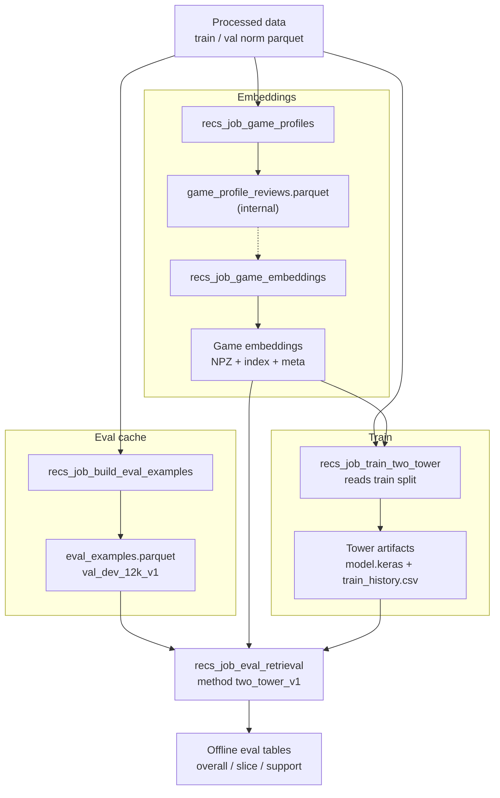

# Two-tower pipeline plan (script-only)

Status: active  
Last reviewed: 2026-05-24

Script-only runbook for **trained two-tower retrieval** (`updated_user__updated_profile200_item`). Exploratory notebooks (`recs_012_task_A`, etc.) are not part of production runs.

**Related:** [`usage_pipeline.md`](usage_pipeline.md) (data + recommender steps), [`recommendation_evaluation_overview.md`](recommendation_evaluation_overview.md) (Task A eval contract).

---

## Design choices

| Choice | Decision |
|--------|----------|
| **Train job reads** | **Game embeddings** (`ContentRetriever` / recs_002 NPZ + index + meta) — **not** `game_profile_reviews.parquet` |
| **Item init** | Rows from `embedding_matrix` (same geometry as catalog); profile parquet is only input to the embeddings job |
| **Training labels** | Task A semantics: `prepare_eval_inputs(split="train")` → other liked apps in train |
| **Benchmark eval** | Cached `eval_examples.parquet` via `recs_job_eval_retrieval.py --examples-parquet` (not the small val set used for `val_loss` during fit) |
| **Winning spec** | `updated_user__updated_profile200_item` — trainable USE user tower + trainable item tower (init from embeddings) |

Profiles parquet is an **internal** artifact between `recs_job_game_profiles` and `recs_job_game_embeddings`. The train job does not open it.

---

## Pipeline (swimlanes)



Solid arrows: primary data flow. Dotted arrow: profiles feeds **embeddings job only**, not train.

---

## Per-job artifacts

| Job | Reads | Writes | Notebooks (explore only) |
|-----|-------|--------|--------------------------|
| `recs_job_game_profiles` | train norm parquet | `game_profile_reviews.parquet` | recs_001 |
| `recs_job_game_embeddings` | profiles parquet | NPZ + index + meta (recs_002) | recs_002 |
| `recs_job_build_eval_examples` | val norm parquet + cohort config | `eval_examples.parquet` | — |
| `recs_job_train_two_tower` *(planned)* | train parquet + **game embeddings** | model + `train_history.csv` + metadata | recs_012_task_A |
| `recs_job_eval_retrieval` *(extended)* | eval cache + embeddings + tower model | `eval_retrieval_*`, `eval_ranking_*`, jsonl | recs_011 |

---

## Train job internals (planned)

**Reads**

- Train norm parquet → `prepare_eval_inputs(split="train")`
- Game embeddings via `ContentRetriever`: catalog matrix, `app_to_row`, USE hub meta
- `item_init` ← `embedding_matrix` rows (no profile parquet at train time)

**Trains**

- User: trainable USE (Hub) → 64-d projection, L2-normalized
- Item: trainable `item_base` (init from embedding rows) → 64-d projection
- Loss: multi-positive in-batch contrastive (Task A row expansion)

**Writes**

- `model.keras` (or SavedModel)
- `train_history.csv` — `loss`, `val_loss`, `user_to_item_loss`, `item_to_user_loss`, per epoch (Keras `History`)
- `run_metadata.json` — config path, spec label, artifact paths, timestamps

**Fit monitoring:** early stopping on contrastive `val_loss` from a held-out val sample is a **training convenience** only; contract metrics come from the cached eval parquet (see [`recommendation_evaluation_overview.md`](recommendation_evaluation_overview.md)).

---

## Commands (no notebooks)

Run from repo root after processed splits exist.

```bash
# 1. Profiles (input to embeddings job)
python scripts/recs_job_game_profiles.py configs/recs_job_game_profiles.json

# 2. Game embeddings (recs_002 catalog)
python scripts/recs_job_game_embeddings.py configs/recs_job_game_embeddings.json

# 3. Fixed eval cohort (Task A)
python scripts/recs_job_build_eval_examples.py configs/recs_job_build_eval_examples.json

# 4. Train two-tower (planned)
python scripts/recs_job_train_two_tower.py configs/recs_job_train_two_tower.json

# 5. Offline eval including tower method (planned: two_tower_v1 in methods)
python scripts/recs_job_eval_retrieval.py configs/recs_job_eval_retrieval.json \
  --examples-parquet artifacts/recs/eval_cache/val_dev_12k_v1/eval_examples.parquet
```

Default tower artifact layout (planned):

```text
artifacts/recs/towers/<run_tag>/
  updated_user__updated_profile200_item.keras
  train_history.csv
  run_metadata.json
```

---

## Implementation phases

1. **[ ]** Extract `steam_review_ml/recommender/two_tower_train.py` from `recs_012_two_tower_training_rows_explore_task_A.ipynb`
2. **[ ]** Add `scripts/recs_job_train_two_tower.py` + `configs/recs_job_train_two_tower.json`
3. **[ ]** Item init from `embedding_matrix` only (drop train-time profile parquet reads)
4. **[ ]** Register `two_tower_v1` scorer in `retrieval_offline_eval` + eval job config
5. **[ ]** Document run order in [`usage_pipeline.md`](usage_pipeline.md) §7

---

## Interactive diagram

A swimlane canvas with the same layout lives in the IDE at:

`canvases/two_tower-pipeline-plan.canvas.tsx` (Cursor project canvases folder)

Use that for visual review; this markdown file is the repo-canonical copy for git and onboarding.
